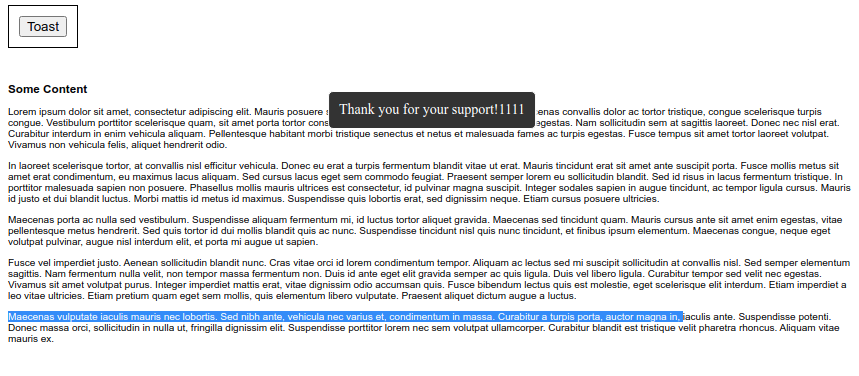

 [](https://codecov.io/gh/internetarchive/iaux-toast-manager)

# Toast Manager Component

A Toast manager built on LitElement with support for custom content and light DOM elements.



## Installation
```bash
yarn add @internetarchive/toast-manager
```

## Usage
```html
<!-- index.html -->
<script type="module">
  import '@internetarchive/toast-manager';
  import { ToastConfig } from '@internetarchive/toast-manager';
</script>

<toast-template></toast-template>

```
### Config Options

All of the config options:

```javascript
const config = new ToastConfig();
config.texts = 'Thank you for your support!1111';
config.bgColor = 'black';
config.dismisOnClick = false;
```

# Development

## Prerequisite
```bash
yarn install
```

## Start Development Server
```bash
yarn start
```

## Testing
```bash
yarn test
```

## Linting
```bash
yarn lint
```
